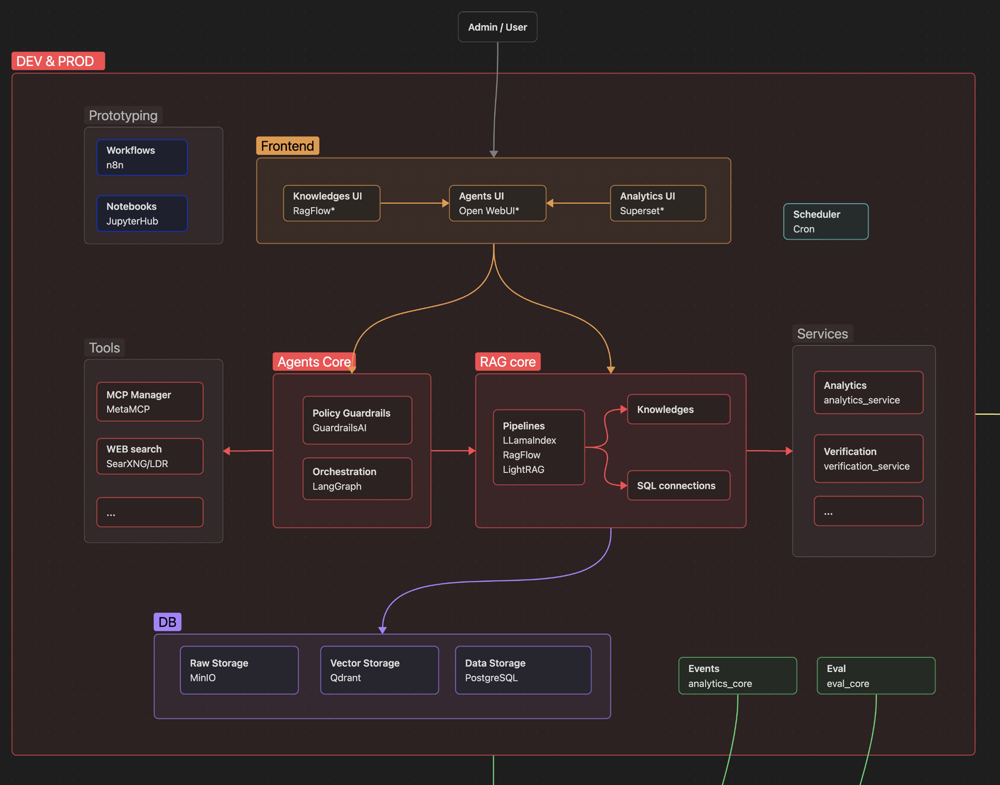
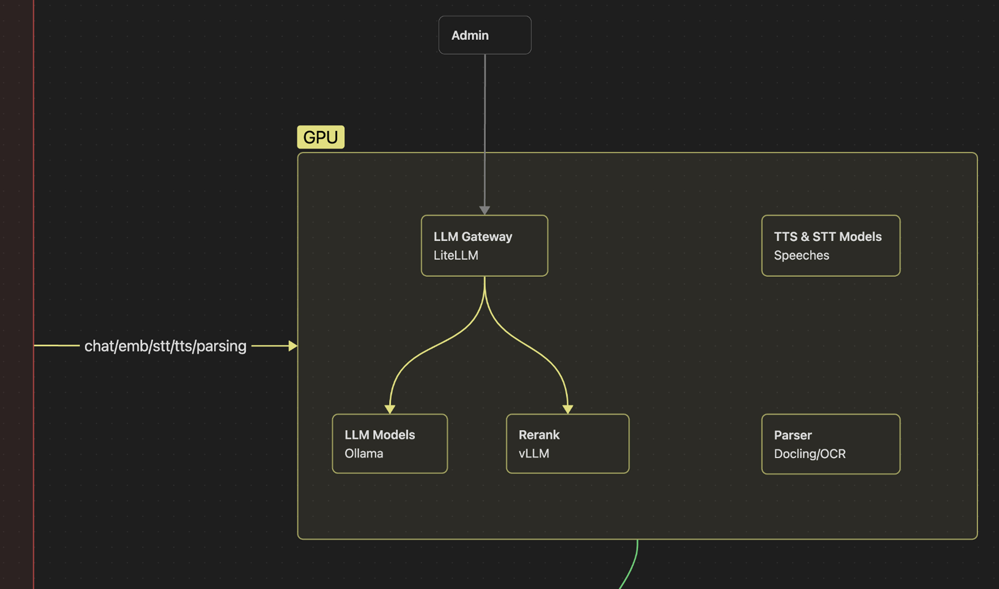
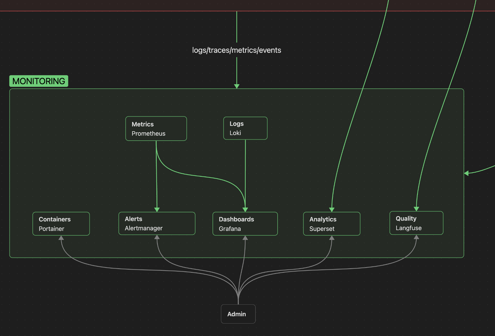

# Axioma AI

Enterprise AI assistant platform для системы управления активами Axioma, используемой в энергетической области.

### Цель

Цель платформы — помочь пользователям работать со сложной enterprise-системой: понимать доменные данные, ориентироваться в процессах, находить нужную информацию и выполнять assisted creation/editing бизнес-объектов.

### Архитектура

Платформа построена как private AI layer вокруг корпоративных данных, доменной документации и системных API. Она объединяет RAG, SQL-доступ, norm-control workflows, локальную LLM-инфраструктуру, observability и LLM evaluation в production-oriented assistant platform.

**Development and production layer:** web UI, LangGraph orchestration, RAG pipelines, MCP/tool integrations, SQL connections, services, storage и deployment structure.

**GPU and model layer:** LiteLLM gateway, локальные модели через Ollama/vLLM, parsing/OCR components и speech-related model services для private/on-premise AI usage.

**Monitoring and quality layer:** metrics, logs, dashboards, analytics, quality tracing, LLM-as-a-judge evaluation workflows, containers, alerts и Langfuse-based LLM observability.

### Что было сделано

- Спроектировал архитектуру production-oriented AI-платформы, а не простого чат-бота.
- Построил multi-agent orchestration со специализированными агентами для разных классов задач.
- Реализовал domain RAG pipelines для документации, регламентов, внутренней базы знаний и system-specific context.
- Добавил SQL sub-agent для анализа структурированных данных и ответов на вопросы по enterprise data.
- Спроектировал norm-control workflows для проверки generated outputs по бизнес- и регуляторным требованиям.
- Спроектировал LLM-as-a-judge и automated evaluation workflows через Langfuse для контроля качества агентных сценариев.
- Интегрировал ассистента с enterprise APIs и внутренними сервисами.
- Развернул локальную LLM-инфраструктуру на серверах компании для private/on-premise usage.
- Настроил Docker-based deployment workflows, CI/CD pipelines и DevOps-процессы совместно с системными администраторами.
- Ввел context-driven development workflow: architecture docs, global prompts, agent instructions, reusable skills и project knowledge рядом с кодовой базой.

### Стек

Python, FastAPI, LangGraph, LangChain, LlamaIndex, RAG, SQL agents, LiteLLM, Langfuse, LLM-as-a-judge, automated evaluation pipelines, PostgreSQL, Docker, CI/CD, local LLMs, Ollama, vLLM, REST APIs, Grafana, Prometheus, Loki.

### Роль

Lead AI Engineer / AI Platform Architect. Отвечаю за архитектуру, backend implementation, agent design, local model infrastructure, deployment workflows, technical direction и координацию AI-разработки.

Работаю с backend engineers, QA, product stakeholders и domain experts, при этом отвечаю за AI architecture, core implementation и техническое направление assistant platform.
