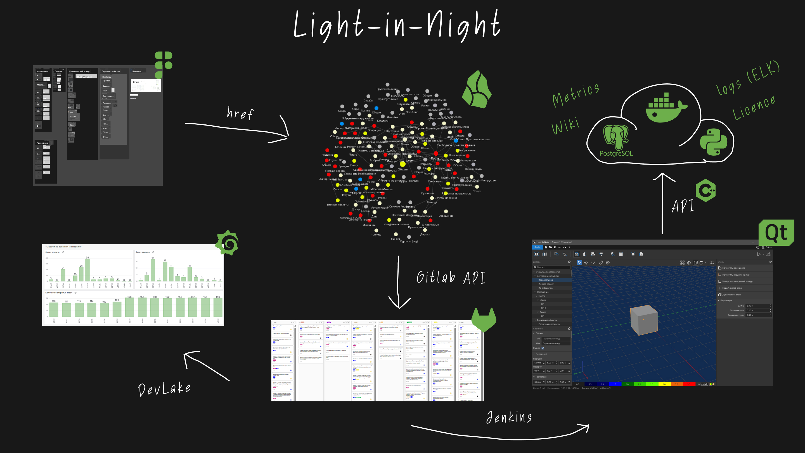

# Light in Night

Профессиональное desktop-приложение для расчета, проектирования и подготовки проектов внутреннего и наружного освещения.

Я подключился к проекту на этапе, когда он был ближе к техническому демо: процессы были не до конца выстроены, планирование фрагментировано, а product workflow требовал систематизации. Основной фокус моей работы — превратить проект в управляемый product development process с полноценной engineering team.

### Цель

Цель проекта — создать production-ready lighting design application и организовать разработку вокруг требований, релизов, quality control и скоординированной работы engineering, QA, design, analytics и management.

### Обзор продукта

**Product and engineering layer:** desktop lighting design workflow, calculation modules, UI/UX work, backend services, task tracking, release planning, logging, metrics, QA processes и AI-assisted development experiments.

### Что было сделано

- Организовал product development process от требований и спецификаций до GitLab issues, backlog, release planning и delivery tracking.
- Собрал и управлял cross-functional team 10+ человек: C++, Python, frontend, DevOps, QA, UX/UI design и analytics.
- Координировал technical planning, product analysis, task decomposition и release management.
- Разрабатывал backend modules и internal services на Python.
- Настроил logging и metrics collection через Elasticsearch, Kibana и Grafana.
- Инициировал использование LLM для UI testing automation и AI-assisted development workflows с инструментами вроде Aider.

### Стек

C++, Python, desktop development, backend services, GitLab, Elasticsearch, Kibana, Grafana, QA automation, LLM-assisted development.

### Роль

Team Lead / Product Analyst. Отвечал за analytics, specifications, planning, backend development, process organization, team coordination и overall technical leadership across engineering, QA, design и product work.
