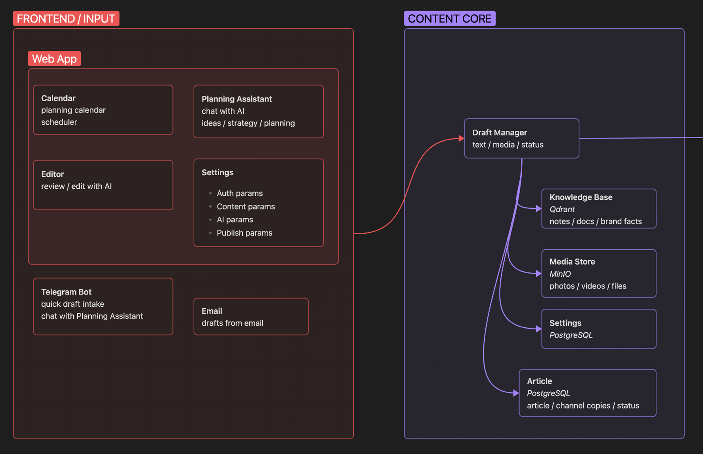
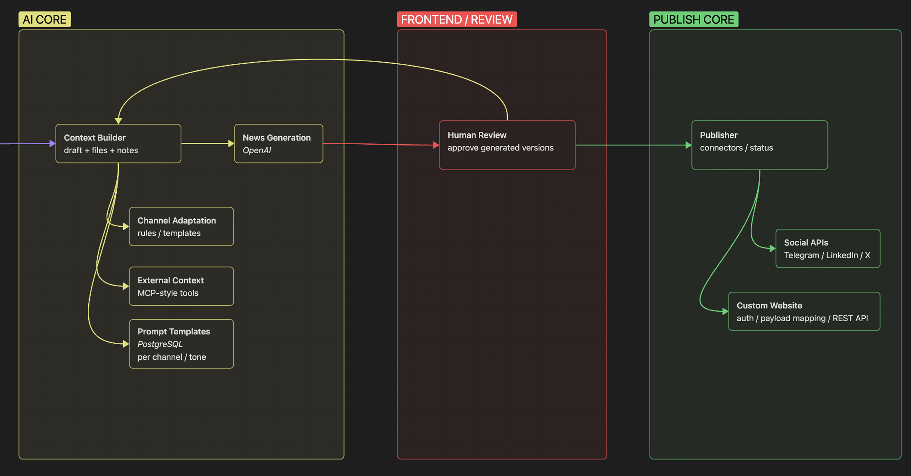

# Smart Publish

AI-assisted publishing platform для подготовки, адаптации, планирования и публикации новостного контента на сайтах и социальных платформах.

Проект не был fully autonomous agent. Это был structured AI workflow: пользователь создает или загружает черновик, AI готовит версии для выбранных площадок, пользователь проверяет результат, после чего система публикует или планирует approved content.

### Цель

Цель проекта — сократить повторяющуюся редакторскую работу для команд и индивидуальных авторов, которые публикуют одну и ту же информацию в нескольких каналах: сайты, социальные сети, мессенджеры и custom CMS integrations.

### Архитектура

Платформа была организована как predictable publishing pipeline. Input channels и editorial tools собирали черновики, content core хранил статьи и контекст, AI core генерировал и адаптировал версии, а publishing core отправлял approved content в подключенные destinations.

**Input and content layer:** web app, planning assistant, editor, calendar, Telegram/email intake, draft management, media storage, settings, articles и knowledge base context.

**AI, review and publishing layer:** context building, news generation, channel adaptation, prompt templates, external context, human review with regeneration loop, publisher, social APIs и custom website connector.

### Что было сделано

- Спроектировал structured AI publishing workflow вместо generic chatbot.
- Построил draft-to-publication pipeline: draft intake, context preparation, article generation, channel adaptation, review, approval и publishing.
- Добавил lightweight Planning Assistant для идей контента, простых publishing calendars, short article briefs и draft preparation.
- Спроектировал prompt templates и правила адаптации одного source draft под разные платформы и tones.
- Реализовал human review loop: пользователь мог редактировать, regenerate, approve или schedule generated versions перед публикацией.
- Спроектировал custom website connector concept: configurable auth, request mapping, media upload, article creation и response parsing.
- Интегрировал workflow с Telegram, email intake, CMS APIs, social publishing APIs, Google Cloud Platform services и external context sources.

### Стек

Python, FastAPI, OpenAI API, structured prompt orchestration, Telegram API, REST APIs, CMS integrations, social platform APIs, Google Cloud Platform (GCP), n8n/background jobs, relational database, object storage, configurable connectors.

### Роль

Lead AI Engineer. Спроектировал product architecture, built backend and AI workflow, создал prompt/template structure, интегрировал Telegram и CMS APIs, спроектировал custom connector approach и подготовил систему для дополнительных publishing destinations.

Работал в небольшой cross-functional R&D-команде с backend, QA и product/design collaboration, отвечая за AI workflow architecture и core backend implementation.
