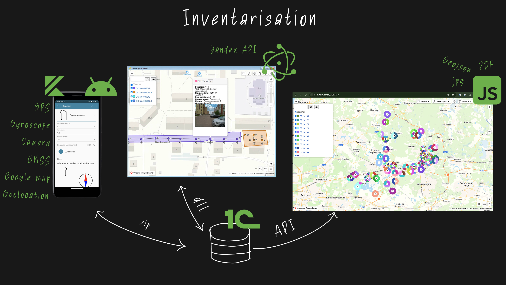
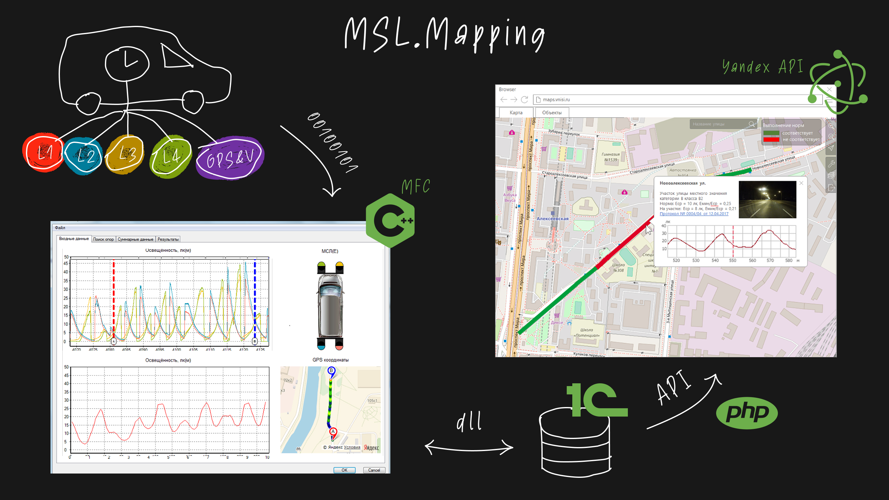
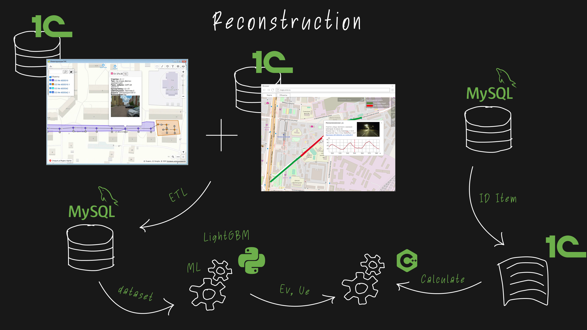

# Urban Lighting

Платформа для городского освещения, объединяющая field inventory, mobile laboratory measurements, geospatial mapping и LightGBM-based reconstruction planning.

Проект объединил несколько связанных инструментов в один pipeline: сбор полевых данных, обработка реальных измерений освещенности, нанесение данных на карту, обучение ML-модели и подготовка рекомендаций по реконструкции.

### Цель

Цель проекта — ускорить и сделать более data-driven планирование реконструкции городского освещения: заменить ручные field reports и разрозненные карты reusable datasets, prediction models, analytics и planning documents.

### Развитие проекта

Платформа выросла из трех связанных engineering stages. Самой сильной частью стал финальный ML and analytics layer; более ранние инструменты создавали структурированные данные, необходимые для prediction и reconstruction planning.

**Field inventory layer:** Android и desktop tools для сбора опор, светильников, координат, фотографий и object metadata во время полевых обследований.

**Measurement layer:** обработка mobile laboratory data: GPS tracks, sensor measurements, illuminance values, road segments и map visualization.

**ML reconstruction layer:** dataset preparation, LightGBM-based illuminance prediction, detection of non-compliant zones, LED replacement recommendations, economic calculations и tender materials.

### Что было сделано

- Спроектировал платформу как pipeline от field data до ML-assisted reconstruction planning.
- Разработал инструменты для inventory объектов наружного освещения и map-based data management.
- Реализовал processing logic для mobile laboratory measurements, GPS tracks и illuminance data.
- Объединил inventory, measurement и geospatial data в reusable datasets.
- Построил ML dataset и LightGBM model для street illuminance prediction.
- Добавил analytics для lighting quality, reconstruction options, LED replacement, economic effect и planning documentation.

### Стек

Android, Electron, JavaScript, Node.js, C++, MFC, GPS/sensor data processing, 1C, PostgreSQL/MySQL-style databases, geospatial data, Python, LightGBM, feature engineering, Google Maps API.

### Роль

Technical lead и full-stack developer. Спроектировал ключевые части архитектуры, разработал data processing components, построил ML dataset и prediction model, объединил field data, measurements, maps и analytics в reconstruction planning workflow.

Координировал работу с software developers, analysts и field engineering stakeholders, чтобы связать практические задачи сбора данных с ML и planning layer.
