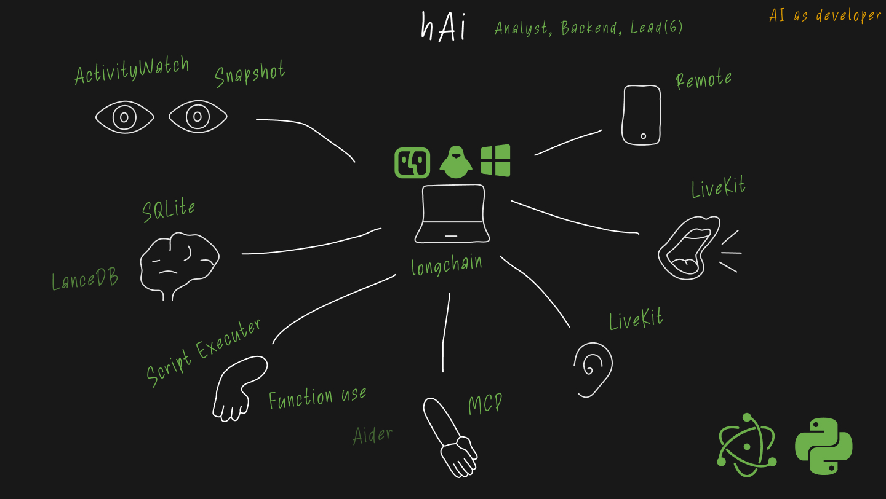

# hAi

Local-first AI assistant platform для работы с контекстом компьютера, персональной памятью, голосовым взаимодействием, локальными моделями и инструментами.

### Цель

Цель проекта — создать практическую assistant platform, которая может работать локально, безопасно использовать пользовательский контекст, взаимодействовать с desktop workflows, поддерживать голос, подключать внешние инструменты через MCP и использовать локальные/облачные LLM.

### Архитектура

**Local assistant layer:** desktop app, Python/FastAPI backend, local memory, ActivityWatch context, screenshots, SQLite/LanceDB storage, LiveKit voice services, MCP tools, script execution, local/cloud LLM routing, Langfuse-based evaluation experiments и AI-assisted development workflows.

### Что было сделано

- Спроектирована архитектура distributed local desktop assistant.
- Разработан backend core для agent logic, memory, model routing и tool use.
- Интегрированы локальные и облачные LLM, включая Ollama-based local model workflows.
- Добавлен ActivityWatch-based computer activity context и snapshot/screenshot-oriented context experiments.
- Реализованы memory и storage concepts на SQLite и LanceDB.
- Интегрированы voice-related components через LiveKit и STT/TTS tools.
- Добавлена поддержка MCP для подключения локальных инструментов, файлов и внешних систем.
- Настроены LLM evaluation experiments, включая LLM-as-a-judge checks и quality tracing через Langfuse.
- Платформа используется как R&D-среда для local models, Mac Studio inference optimization, agent UX и AI-assisted development.

### Стек

Python, FastAPI, Electron, React, TypeScript, LangGraph, LangChain, SQLAlchemy, SQLite, LanceDB, ActivityWatch, LiveKit, MCP, Langfuse, LLM-as-a-judge, Google Cloud Platform (GCP), Ollama, OpenAI, Gemini, Whisper, Piper, Moondream.

### Роль

Lead AI Developer / AI Platform Engineer. Отвечал за end-to-end architecture, backend core, agent logic, memory concepts, local/cloud model integrations, tool use и desktop context experiments.

Проект развивался как AI-assistant platform и R&D-направление для проверки современных agentic AI-подходов на практике.
